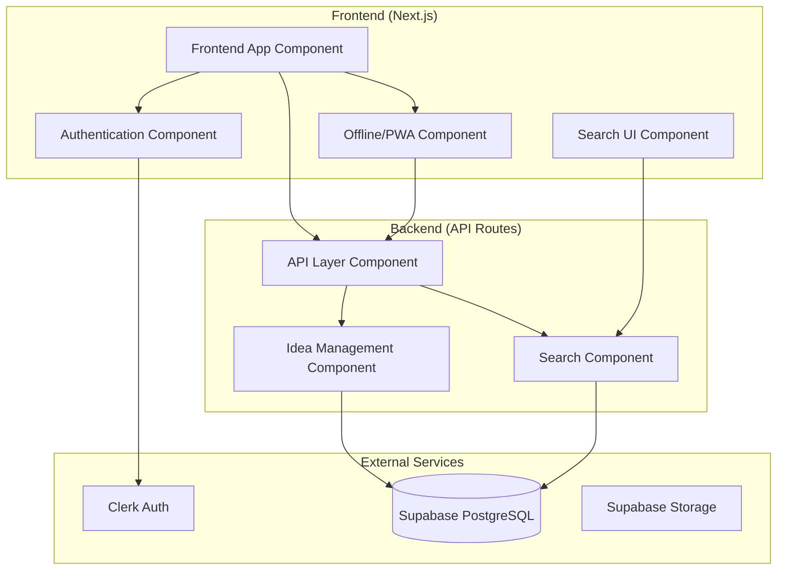

# Components

## API Layer Component
**Responsibility:** Handles all backend API endpoints, authentication, and data validation

**Key Interfaces:**
- REST endpoints for CRUD operations on ideas
- Authentication middleware integration
- PostgreSQL database connection and queries
- Full-text search implementation

**Dependencies:** Supabase client, Clerk authentication, PostgreSQL

**Technology Stack:** Next.js API Routes, TypeScript, Supabase-js, Clerk SDK

## Idea Management Component
**Responsibility:** Core business logic for the two-stage capture/commit workflow

**Key Interfaces:**
- Draft creation and editing services
- Commit workflow processing
- Idea retrieval and filtering
- Search functionality with ranking

**Dependencies:** API Layer, Database Component

**Technology Stack:** TypeScript business logic, PostgreSQL stored procedures

## Frontend App Component
**Responsibility:** React-based user interface implementing the UX specification

**Key Interfaces:**
- Quick capture interface
- Draft management views
- Idea pool dashboard
- Search and discovery UI

**Dependencies:** API Layer, Authentication Component, Offline Component

**Technology Stack:** Next.js, React 18, TypeScript, Tailwind CSS, Headless UI

## Authentication Component
**Responsibility:** User authentication, session management, and authorization

**Key Interfaces:**
- Login/logout flows
- Protected route middleware
- User profile management
- Session persistence

**Dependencies:** Clerk service, API Layer

**Technology Stack:** Clerk React SDK, Next.js middleware

## Offline/PWA Component
**Responsibility:** Service Worker implementation for offline functionality

**Key Interfaces:**
- Draft persistence in local storage
- Background sync when online
- Conflict resolution UI
- Cache management for committed ideas

**Dependencies:** Browser APIs, API Layer

**Technology Stack:** Service Worker API, IndexedDB, React Context

## Search Component
**Responsibility:** Full-text search implementation with ranking and highlighting

**Key Interfaces:**
- PostgreSQL full-text search queries
- Result ranking and relevance scoring
- Search result highlighting
- Search analytics

**Dependencies:** Database Component, API Layer

**Technology Stack:** PostgreSQL GIN indexes, tsvector, ts_rank functions

## Component Diagrams

