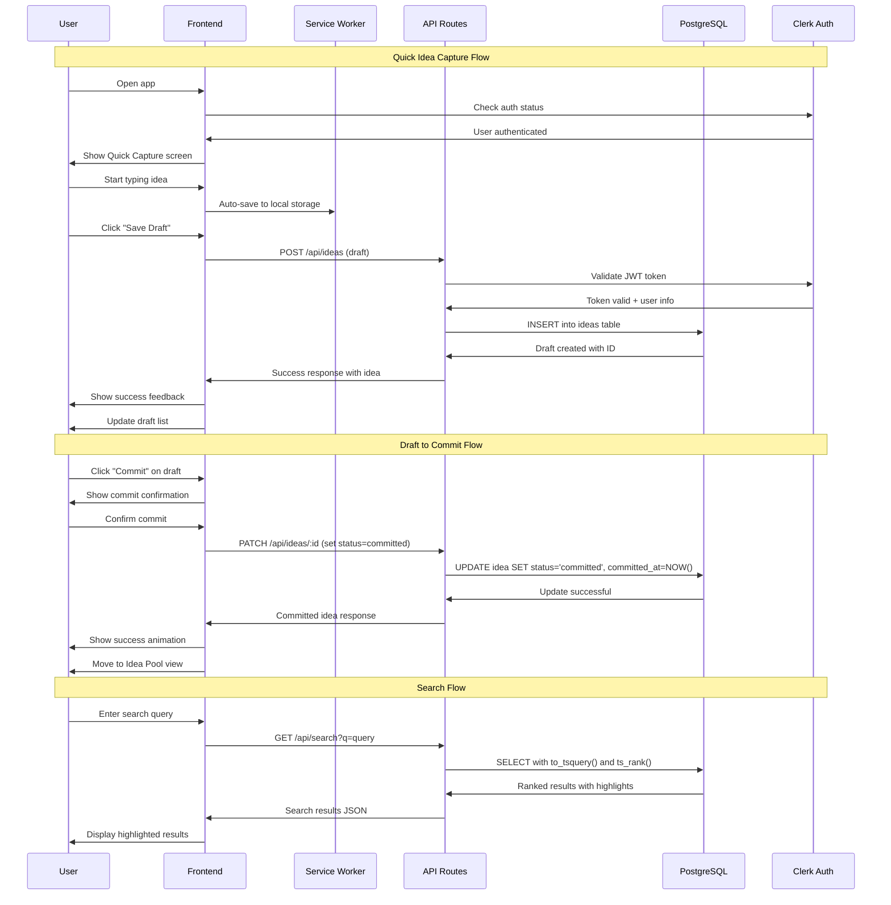

# Core Workflows

```mermaid
sequenceDiagram
    participant U as User
    participant FE as Frontend
    participant SW as Service Worker
    participant API as API Routes
    participant DB as PostgreSQL
    participant CLERK as Clerk Auth

    Note over U,CLERK: Quick Idea Capture Flow
    U->>FE: Open app
    FE->>CLERK: Check auth status
    CLERK->>FE: User authenticated
    FE->>U: Show Quick Capture screen
    U->>FE: Start typing idea
    FE->>SW: Auto-save to local storage
    U->>FE: Click "Save Draft"
    FE->>API: POST /api/ideas (draft)
    API->>CLERK: Validate JWT token
    CLERK->>API: Token valid + user info
    API->>DB: INSERT into ideas table
    DB->>API: Draft created with ID
    API->>FE: Success response with idea
    FE->>U: Show success feedback
    FE->>U: Update draft list

    Note over U,CLERK: Draft to Commit Flow
    U->>FE: Click "Commit" on draft
    FE->>U: Show commit confirmation
    U->>FE: Confirm commit
    FE->>API: PATCH /api/ideas/:id (set status=committed)
    API->>DB: UPDATE idea SET status='committed', committed_at=NOW()
    DB->>API: Update successful
    API->>FE: Committed idea response
    FE->>U: Show success animation
    FE->>U: Move to Idea Pool view

    Note over U,CLERK: Search Flow
    U->>FE: Enter search query
    FE->>API: GET /api/search?q=query
    API->>DB: SELECT with to_tsquery() and ts_rank()
    DB->>API: Ranked results with highlights
    API->>FE: Search results JSON
    FE->>U: Display highlighted results
```
