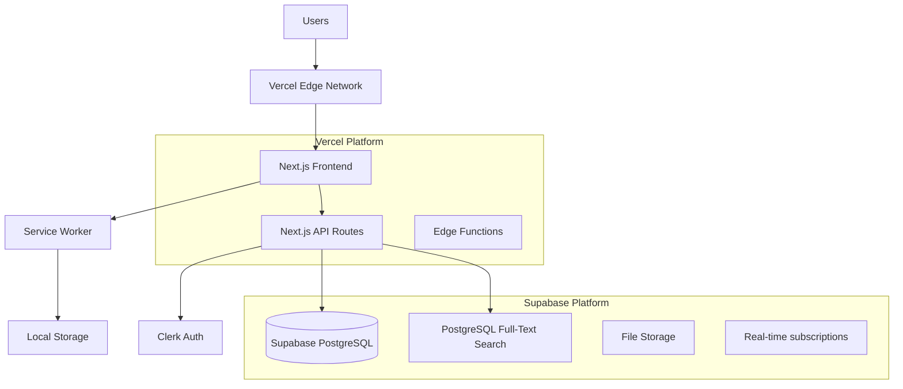

# High Level Architecture

## Technical Summary
IdeaStash follows a modern Jamstack architecture with a Next.js React frontend deployed on Vercel and a serverless backend API using PostgreSQL database hosted on Railway/Supabase. The application implements a Progressive Web App (PWA) pattern with offline-first capabilities, using Service Workers for caching and local storage for draft persistence. The core two-stage capture/commit workflow is supported by a RESTful API with real-time synchronization, full-text search via PostgreSQL, and seamless authentication through Clerk. This architecture maximizes development velocity while ensuring scalability, security, and the sub-200ms response times required for optimal idea capture.

## Platform and Infrastructure Choice
**Platform:** Vercel + Supabase
**Key Services:** Vercel (Frontend Hosting, Edge Functions), Supabase (Database, Auth, Storage), Clerk (Alternative Auth), Railway (Alternative Database)
**Deployment Host and Regions:** Vercel Edge Network (Global CDN), Supabase US-East-1 (primary database region)

## Repository Structure
**Structure:** Monorepo with Next.js app and API routes
**Monorepo Tool:** Turborepo for build optimization and caching
**Package Organization:** Single Next.js app with API routes, shared utilities in lib folder

## High Level Architecture Diagram

## Architectural Patterns
- **Jamstack Architecture:** Next.js SSG/SSR with serverless API functions - _Rationale:_ Optimal performance, SEO, and developer experience
- **Progressive Web App:** Service Worker + offline capabilities - _Rationale:_ Ensures idea capture works without internet connection
- **API-First Design:** RESTful API with clear contracts - _Rationale:_ Enables future mobile apps and third-party integrations
- **Repository Pattern:** Abstract data access logic - _Rationale:_ Enables testing and potential database migration flexibility
- **Component-Based UI:** Reusable React components with TypeScript - _Rationale:_ Maintainability and type safety across codebase
