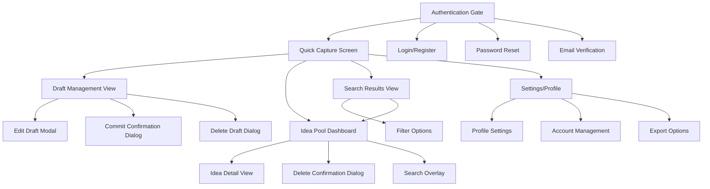
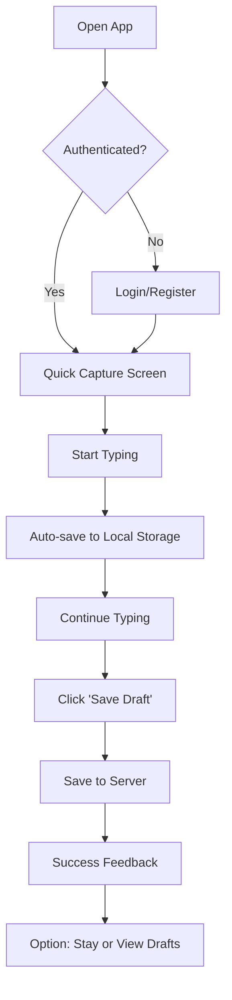
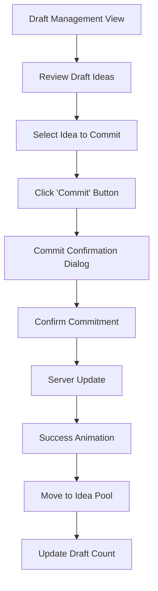
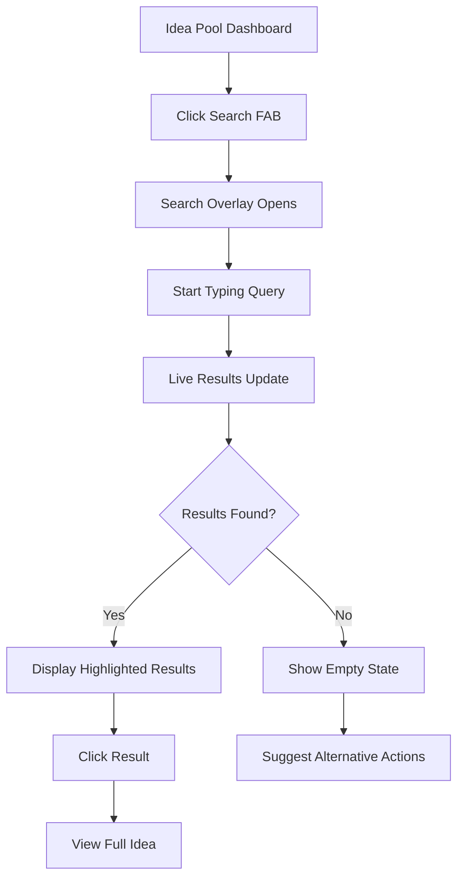
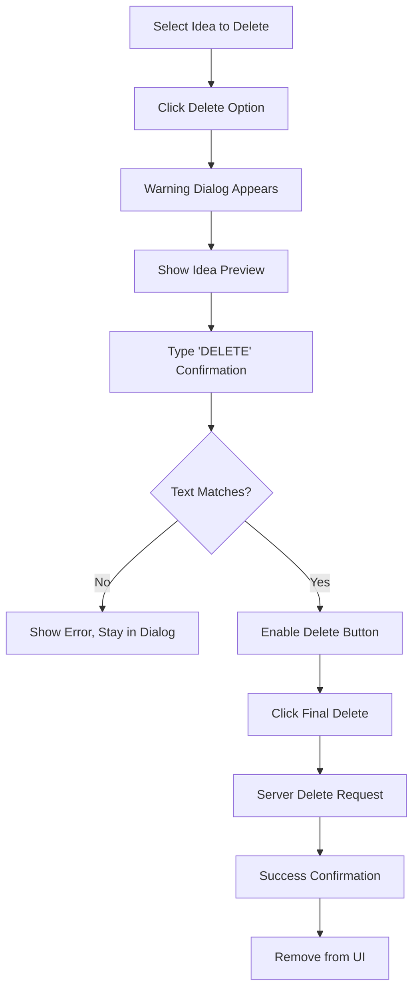

# IdeaStash UI/UX Specification

This document defines the user experience goals, information architecture, user flows, and visual design specifications for IdeaStash's user interface. It serves as the foundation for visual design and frontend development, ensuring a cohesive and user-centered experience.

## Overall UX Goals & Principles

### Target User Personas

**Primary Persona: Solo Entrepreneur & Creator**
- Age 25-45, tech-savvy individuals in creative or business roles
- Currently using multiple inconsistent tools (Notes, Tumblr, notebooks)
- Pain points: Lost ideas, poor organization, no sense of idea progression
- Goals: Quick capture, permanent preservation, occasional review for development
- Workflow: Idea sparks → quick capture → occasional review → selective development

**Secondary Persona: Innovation Team Member**
- Small teams (2-10 people) working on creative projects
- Currently using scattered tools (Slack, shared docs, whiteboards)
- Pain points: Ideas lost in chat history, no central repository
- Goals: Centralized capture, contribution tracking, collaborative review

### Usability Goals

- **Immediate Capture**: Users can capture ideas within 3 seconds of opening the app
- **Zero Learning Curve**: Core capture functionality requires no explanation or tutorial
- **Trust & Permanence**: Users feel confident their committed ideas are permanently preserved
- **Intentional Workflow**: Two-stage process (draft→commit) feels natural, not burdensome
- **Rapid Retrieval**: Users can find specific ideas through search within 5 seconds

### Design Principles

1. **Clarity over Cleverness** - Prioritize clear communication over aesthetic innovation
2. **Immediate Trust** - Every interaction reinforces the "never lose an idea" promise
3. **Intentional Friction** - Strategic friction for commit/delete actions, zero friction for capture
4. **Journal-like Intimacy** - Interface feels personal and private like writing in a trusted notebook
5. **Progressive Disclosure** - Show only what's needed for the current task

### Change Log

| Date | Version | Description | Author |
|------|---------|-------------|---------|
| 2025-09-25 | 1.0 | Initial UI/UX specification creation | Sally (UX Expert) |

## Information Architecture (IA)

### Site Map / Screen Inventory

### Navigation Structure

**Primary Navigation:** Bottom tab bar (mobile) / Left sidebar (desktop) with 4 core sections:
- Quick Capture (home icon) - Primary landing screen
- Drafts (edit icon) - Draft management with badge count
- Ideas (archive icon) - Committed idea pool
- Profile (user icon) - Settings and account

**Secondary Navigation:**
- Search accessible from floating action button on Ideas screen
- Settings accessible through profile section
- Modal/overlay navigation for all confirmation dialogs

**Breadcrumb Strategy:** Minimal breadcrumbs only for deep states (Search Results → back to Ideas)

## User Flows

### Flow 1: Quick Idea Capture

**User Goal:** Capture a new idea as quickly as possible before forgetting it

**Entry Points:** App launch, Quick Capture tab, floating "+" button

**Success Criteria:** Idea saved as draft within 10 seconds of having the thought

#### Flow Diagram

#### Edge Cases & Error Handling:
- Offline mode: Save locally, sync when online
- Network error: Show retry option, preserve local data
- Server error: Fallback to local storage, show status
- Empty content: Prevent save, show gentle reminder
- Character limits: Soft warning, no hard limits for MVP

**Notes:** Auto-focus text area on screen entry, keyboard shortcuts for power users

### Flow 2: Draft-to-Commit Workflow

**User Goal:** Review and permanently preserve valuable ideas

**Entry Points:** Draft Management View, notification prompts

**Success Criteria:** Draft successfully committed with confirmation feedback

#### Flow Diagram

#### Edge Cases & Error Handling:
- Bulk commit: Progress indicator for multiple ideas
- Server timeout: Retry mechanism with visual feedback
- Accidental commit: Clear but not intrusive undo option (30-second window)
- Duplicate detection: Optional feature for future versions

**Notes:** Satisfying commit animation reinforces permanence concept

### Flow 3: Search & Discovery

**User Goal:** Find specific ideas from committed pool

**Entry Points:** Search button, keyboard shortcut, voice command (future)

**Success Criteria:** Relevant ideas found within 3 search attempts

#### Flow Diagram

#### Edge Cases & Error Handling:
- No results: Suggest browsing all ideas, check spelling
- Search server down: Show cached results only, indicate limitation
- Very long queries: Truncate gracefully, show full query in hint
- Special characters: Handle gracefully, escape appropriately

**Notes:** Live search results provide immediate feedback, highlight matching terms

### Flow 4: Intentional Deletion

**User Goal:** Remove unwanted committed ideas with safety measures

**Entry Points:** Three-dot menu on idea cards, bulk selection

**Success Criteria:** Idea deleted with confidence it was intentional

#### Flow Diagram

#### Edge Cases & Error Handling:
- Accidental dialog trigger: Easy cancel, no data loss
- Server deletion fails: Show error, keep idea visible, retry option
- Network loss during delete: Queue for retry when online
- Bulk deletion: Progress indicator, ability to cancel mid-process

**Notes:** Multiple confirmation steps prevent accidental deletion of valuable ideas

## Wireframes & Mockups

**Primary Design Files:** Will be created in Figma - [Link to be provided]

### Key Screen Layouts

#### Quick Capture Screen
**Purpose:** Minimal friction idea entry with immediate save options

**Key Elements:**
- Full-screen text area with subtle placeholder text
- Character count (subtle, non-intrusive)
- Auto-save indicator (small, in corner)
- Two action buttons: "Save Draft" (primary), "Commit Now" (secondary)
- Offline status indicator when applicable

**Interaction Notes:** Text area auto-focuses on screen entry, keyboard shortcuts for save actions, swipe gestures for navigation

**Design File Reference:** [Figma Frame: Quick-Capture-V1]

#### Draft Management View
**Purpose:** Staging area for uncommitted ideas with bulk actions

**Key Elements:**
- Card-based layout with idea previews (first 100 characters)
- Visual distinction from committed ideas (border color, background)
- Action buttons per card: Edit, Commit, Delete
- Bulk selection checkboxes
- Empty state with onboarding guidance

**Interaction Notes:** Swipe actions for quick commit/delete, pull-to-refresh, infinite scroll for large lists

**Design File Reference:** [Figma Frame: Draft-Management-V1]

#### Idea Pool Dashboard
**Purpose:** Chronological browsing of permanently preserved ideas

**Key Elements:**
- Timeline-style layout with timestamps
- Full idea content display
- Preservation indicators (lock icon, commit date)
- Floating search action button
- Pull-to-refresh capability

**Interaction Notes:** Smooth scrolling with momentum, tap to expand/collapse long ideas, sharing options per idea

**Design File Reference:** [Figma Frame: Idea-Pool-V1]

## Component Library / Design System

**Design System Approach:** Custom minimal design system optimized for idea management, focusing on clarity and trust over visual complexity

### Core Components

#### IdeaCard Component
**Purpose:** Consistent display of ideas across all views with state-specific styling

**Variants:** Draft Card, Committed Card, Search Result Card

**States:** Default, Hover, Selected, Loading, Error, Offline-Pending

**Usage Guidelines:** Always show timestamps, maintain consistent padding, use state-specific colors for borders

#### ActionButton Component
**Purpose:** Consistent interaction patterns for all user actions

**Variants:** Primary (Commit/Save), Secondary (Draft), Danger (Delete), Ghost (Cancel)

**States:** Default, Hover, Active, Loading, Disabled

**Usage Guidelines:** Minimum 44px touch targets, clear labels, loading states for async actions

#### SearchInput Component
**Purpose:** Unified search experience with live results

**Variants:** Overlay Search, Inline Search, Voice Search (future)

**States:** Empty, Typing, Loading, Results, No Results

**Usage Guidelines:** Immediate focus on activation, clear affordances for clearing search

## Branding & Style Guide

**Brand Guidelines:** Custom branding emphasizing trust, permanence, and creativity

### Color Palette

| Color Type | Hex Code | Usage |
|------------|----------|-------|
| Primary | #1e40af | Trust elements, committed ideas, primary actions |
| Secondary | #10b981 | Success states, commit confirmations |
| Accent | #f59e0b | Draft states, pending actions, warnings |
| Success | #10b981 | Positive feedback, successful commits |
| Warning | #f59e0b | Cautions, draft states, important notices |
| Error | #ef4444 | Errors, destructive actions, deletion |
| Neutral | #6b7280, #f9fafb, #374151 | Text, borders, backgrounds |

### Typography

#### Font Families
- **Primary:** Inter (web-safe, highly legible)
- **Secondary:** System fonts for optimal performance
- **Monospace:** SF Mono, Consolas (timestamps, technical info)

#### Type Scale

| Element | Size | Weight | Line Height |
|---------|------|---------|-------------|
| H1 | 32px | 700 | 1.2 |
| H2 | 24px | 600 | 1.3 |
| H3 | 20px | 600 | 1.4 |
| Body | 16px | 400 | 1.6 |
| Small | 14px | 400 | 1.5 |

### Iconography
**Icon Library:** Heroicons (consistent, minimal, open-source)

**Usage Guidelines:** 24px default size, outline style for actions, solid for states

### Spacing & Layout
**Grid System:** 8px base unit system for consistent spacing

**Spacing Scale:** 4px, 8px, 16px, 24px, 32px, 48px, 64px

## Accessibility Requirements

### Compliance Target
**Standard:** WCAG 2.1 AA compliance for professional accessibility

### Key Requirements

**Visual:**
- Color contrast ratios: 4.5:1 for normal text, 3:1 for large text
- Focus indicators: 2px solid outline with high contrast
- Text sizing: Support up to 200% zoom without horizontal scrolling

**Interaction:**
- Keyboard navigation: Tab order follows visual flow, all actions accessible
- Screen reader support: Proper ARIA labels, semantic HTML structure
- Touch targets: Minimum 44px for mobile interactions

**Content:**
- Alternative text: Descriptive alt text for all meaningful images/icons
- Heading structure: Logical H1-H6 hierarchy for screen readers
- Form labels: Explicit labels associated with all form controls

### Testing Strategy
Regular testing with screen readers (VoiceOver, NVDA), keyboard-only navigation, and automated accessibility tools (axe-core)

## Responsiveness Strategy

### Breakpoints

| Breakpoint | Min Width | Max Width | Target Devices |
|------------|-----------|-----------|----------------|
| Mobile | 320px | 767px | Phones, small tablets |
| Tablet | 768px | 1023px | iPads, Android tablets |
| Desktop | 1024px | 1439px | Laptops, small desktops |
| Wide | 1440px | - | Large monitors, ultrawide |

### Adaptation Patterns

**Layout Changes:** Single column mobile, two-column tablet, three-column desktop with sidebar

**Navigation Changes:** Bottom tabs mobile, sidebar desktop, hamburger menu for tablet

**Content Priority:** Idea content prioritized on mobile, metadata visible on larger screens

**Interaction Changes:** Touch gestures mobile, hover states desktop, hybrid approach tablet

## Animation & Micro-interactions

### Motion Principles
Subtle, purposeful animations that enhance understanding without distraction. Focus on state transitions, feedback, and spatial relationships.

### Key Animations
- **Idea Commit Animation:** Gentle slide from drafts to ideas with success checkmark (Duration: 400ms, Easing: ease-out)
- **Search Results Fade-in:** Staggered appearance of results for perceived performance (Duration: 200ms, Easing: ease-in-out)
- **Save Success Pulse:** Brief scale animation on save confirmation (Duration: 150ms, Easing: ease-in-out)
- **Delete Warning Shake:** Subtle shake if user tries to delete without proper confirmation (Duration: 300ms, Easing: ease-in-out)
- **Offline Sync Indicator:** Rotating sync icon when reconnecting (Duration: 1000ms, Easing: linear, infinite)

## Performance Considerations

### Performance Goals
- **Page Load:** Initial app load under 2 seconds on 3G
- **Interaction Response:** All UI interactions under 100ms feedback
- **Animation FPS:** Maintain 60fps for all animations

### Design Strategies
Progressive loading with skeleton screens, optimized images with WebP format, virtual scrolling for large idea lists, strategic use of CSS animations over JavaScript

## Next Steps

### Immediate Actions
1. Create detailed visual designs in Figma based on this specification
2. Conduct user testing sessions with target personas for validation
3. Review accessibility requirements with development team
4. Finalize component specifications with technical constraints
5. Create interactive prototype for stakeholder review

### Design Handoff Checklist
- [✓] All user flows documented with edge cases
- [✓] Component inventory complete with states and variants
- [✓] Accessibility requirements defined with specific standards
- [✓] Responsive strategy clear with breakpoints and adaptations
- [✓] Brand guidelines incorporated with complete color/typography system
- [✓] Performance goals established with measurable targets