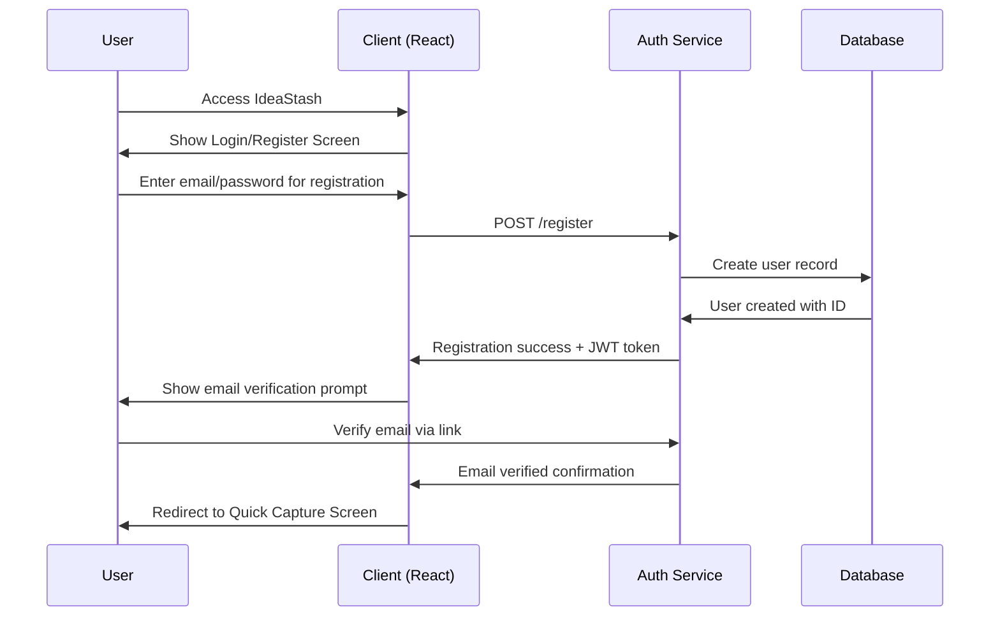
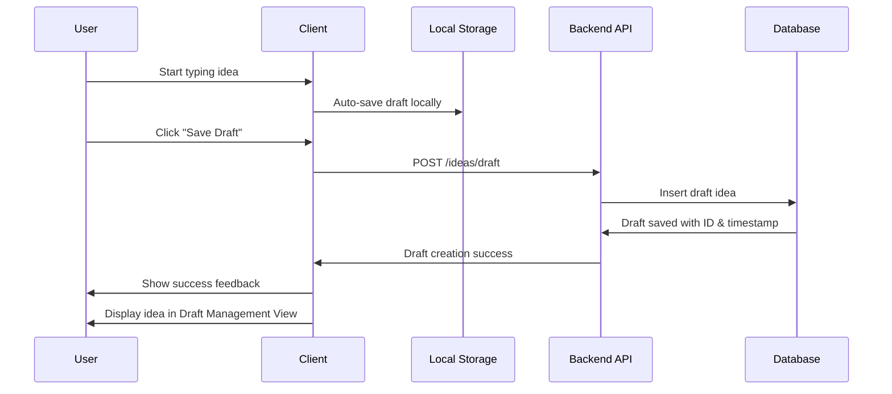
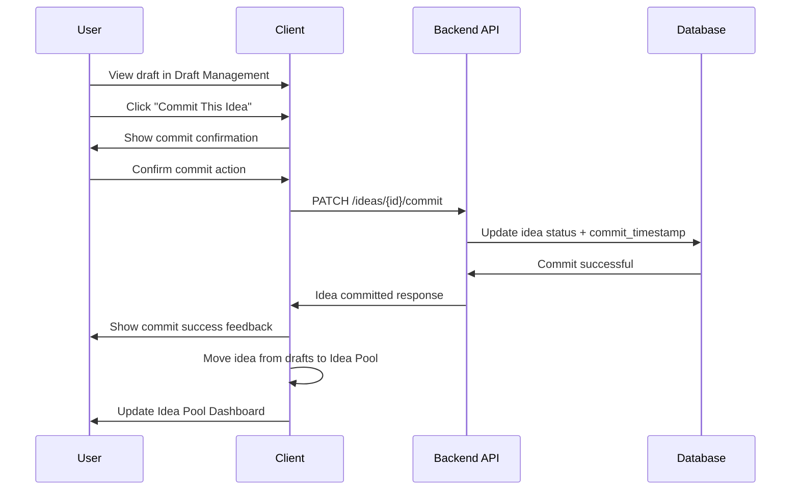
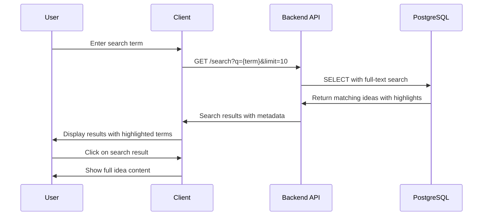
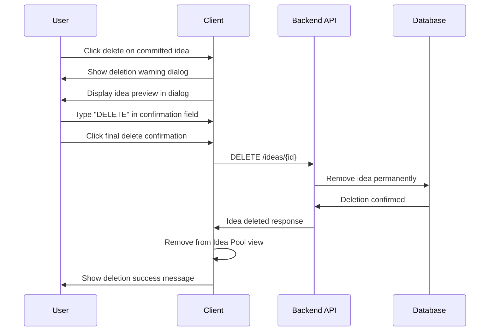
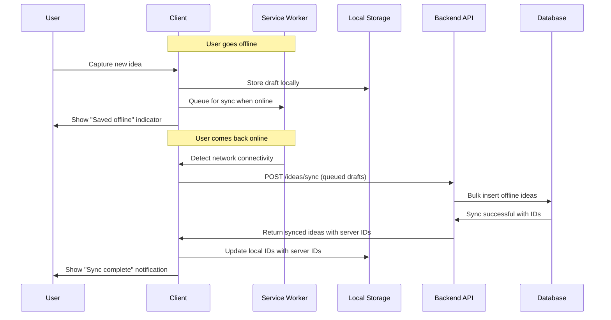

# IdeaStash Product Requirements Document (PRD)

## Goals and Background Context

### Goals
- Create a reliable system that prevents entrepreneurs from losing valuable startup ideas through accidental deletion
- Establish a two-stage capture/commit process that balances quick idea entry with intentional preservation
- Build a timestamped idea repository that allows users to track their creative evolution over time
- Achieve measurable improvement over current tools like Notes apps and Tumblr for idea management
- Launch MVP within 3 months with 1,000+ daily active users within 6 months
- Maintain 70% user retention rate after first week with 90% of ideas being committed (not abandoned in drafts)

### Background Context
IdeaStash addresses the critical gap between quick idea capture and permanent preservation that plagues creative entrepreneurs. Current solutions like basic note apps are too vulnerable to accidental deletion, while platforms like Tumblr weren't designed for intentional idea curation. The app introduces a git-like "commit" concept to idea management, where users can quickly capture thoughts but must intentionally preserve them, creating an impossible-to-lose timestamped idea pool. This approach transforms the chaotic process of managing startup ideas into a reliable system that encourages both rapid capture and thoughtful review.

### Change Log
| Date | Version | Description | Author |
|------|---------|-------------|---------|
| 2025-09-25 | 1.0 | Initial PRD creation from Project Brief | John (PM Agent) |

## Requirements

### Functional Requirements

**FR1:** The system shall provide a quick text entry interface for capturing ideas with minimal friction and no mandatory fields beyond the idea content.

**FR2:** The system shall implement a two-stage process where captured ideas exist in a "draft" state before being intentionally "committed" to permanent storage.

**FR3:** The system shall display committed ideas in a chronological, timestamped "Idea Pool" view showing capture time and commit time separately.

**FR4:** The system shall require explicit confirmation beyond accidental hotkey presses for deleting any committed idea.

**FR5:** The system shall provide full-text search functionality across all committed ideas.

**FR6:** The system shall preserve all committed ideas with immutable timestamps and prevent accidental loss through system safeguards.

**FR7:** The system shall distinguish visually between draft and committed ideas throughout the interface.

**FR8:** The system shall support user authentication and maintain separate idea pools per authenticated user.

**FR9:** The system shall allow users to edit draft ideas but lock committed ideas from modification to maintain historical integrity.

### Non-Functional Requirements

**NFR1:** The system shall respond to user actions within 200ms for optimal user experience during idea capture.

**NFR2:** The system shall support offline functionality for basic idea capture with sync when connection is restored.

**NFR3:** The system shall work reliably across modern browsers (Chrome, Firefox, Safari, Edge) with responsive design.

**NFR4:** The system shall maintain 99.5% uptime to ensure ideas are never lost due to system unavailability.

**NFR5:** The system shall encrypt user data both in transit and at rest to protect intellectual property.

**NFR6:** The system shall handle database performance efficiently even with users storing thousands of ideas.

**NFR7:** The system shall follow GDPR compliance patterns in preparation for potential future expansion.

## User Interface Design Goals

### Overall UX Vision
Clean, minimal interface focused on rapid idea capture with clear visual hierarchy. The experience should feel like "writing in a personal journal" but with the confidence of permanent preservation. Zero learning curve for basic capture, with the commit process being intuitive and satisfying rather than burdensome.

### Key Interaction Paradigms
- **Single-action capture**: One click/tap to start writing an idea
- **Intentional commitment**: Clear, satisfying gesture to commit ideas (not accidental)
- **Chronological browsing**: Timeline-style scrolling through idea history
- **Instant search**: Live filtering as users type search queries

### Core Screens and Views

**Primary Application Screens:**
- **Quick Capture Screen**: Minimal text input with clear draft/commit controls
- **Idea Pool Dashboard**: Chronological feed of committed ideas with timestamps
- **Draft Management View**: Staging area for uncommitted ideas
- **Search Results View**: Filtered idea list with highlighting
- **Settings/Profile Screen**: Basic account and preference management

**Authentication Screens:**
- **Login/Registration Screen**: Secure authentication with email/password
- **Password Reset Screen**: Self-service password recovery flow
- **Email Verification Screen**: Account activation confirmation

**Modal/Dialog Screens:**
- **Commit Confirmation Dialog**: Success feedback after committing ideas
- **Intentional Delete Confirmation**: Multi-step deletion prevention dialog
- **Sync Conflict Resolution Dialog**: Handle offline/online data conflicts

**State & Feedback Screens:**
- **Offline Status Indicator**: Visual indicator of connection status
- **Empty State Screens**: No drafts, no ideas, no search results scenarios
- **Error State Screens**: Network errors, server errors, data loading failures
- **Loading States**: Idea submission, search, sync in progress

### Accessibility: WCAG AA
Full keyboard navigation support, proper screen reader compatibility, and color contrast meeting WCAG AA standards for professional accessibility.

### Branding
Clean, modern aesthetic with emphasis on trust and permanence. Subtle visual cues that reinforce the "never lose an idea" promise - perhaps using visual metaphors of preservation or archival systems.

### Target Device and Platforms: Web Responsive
Progressive Web App optimized for both desktop and mobile devices, with the same core functionality available across all screen sizes.

## User Flow Sequence Diagrams

### 1. User Registration & Authentication Flow

### 2. Quick Idea Capture Flow

### 3. Draft-to-Commit Workflow

### 4. Search & Discovery Flow

### 5. Intentional Deletion Flow

### 6. Offline Sync Flow

## Technical Assumptions

### Repository Structure: Monorepo
Single repository with separate client and server directories for simplified development workflow and easier dependency management during MVP phase.

### Service Architecture
**Monolithic REST API with PWA frontend** - Simple Express.js backend serving a React frontend. This provides the right balance of simplicity for MVP development while supporting the offline functionality and performance requirements.

### Testing Requirements
**Unit + Integration testing** focused on core business logic (idea persistence, search functionality) and critical user flows (capture, commit, search). Manual testing convenience methods for rapid iteration during development.

### Additional Technical Assumptions and Requests
- **Database**: PostgreSQL with full-text search capabilities for idea content
- **Authentication**: Auth0 or Clerk for secure, hassle-free user management
- **Hosting**: Vercel for frontend, Railway/Supabase for backend to maximize free tier usage
- **State Management**: React Context for simplicity, avoiding complex state libraries for MVP
- **Offline Strategy**: Service Worker for caching committed ideas, local storage for draft persistence
- **Search Implementation**: PostgreSQL full-text search with potential upgrade to dedicated search service post-MVP
- **Data Migration Strategy**: Database migration scripts from day one to support schema evolution

## Epic List

**Epic 1: Foundation & Core Infrastructure**
Establish project setup, authentication system, and basic idea capture functionality with health checks and deployment pipeline.

**Epic 2: Draft-to-Commit Workflow**
Implement the core two-stage process that allows users to capture ideas as drafts and intentionally commit them to permanent storage.

**Epic 3: Idea Pool & Search**
Create the chronological idea browsing experience with full-text search capabilities and timestamp display.

**Epic 4: Data Protection & Polish**
Add intentional deletion safeguards, offline functionality, and performance optimizations for production readiness.

## Epic Details

### Epic 1: Foundation & Core Infrastructure
**Expanded Goal:** Establish a fully functional web application with user authentication and basic idea capture that can be deployed and accessed by users, while setting up all development and deployment infrastructure for rapid iteration.

#### Story 1.1: Project Setup and Deployment Pipeline
As a **developer**,
I want **a complete development environment with automated deployment**,
so that **I can build and ship features quickly with confidence**.

**Acceptance Criteria:**
1. React + TypeScript frontend with Vite build setup
2. Express.js backend with TypeScript configuration
3. PostgreSQL database with connection pooling
4. Automated deployment to Vercel (frontend) and Railway (backend)
5. Environment variable management for all deployment stages
6. Basic health check endpoints returning system status

#### Story 1.2: User Authentication System
As a **potential user**,
I want **to securely create an account and sign in**,
so that **my ideas are private and accessible only to me**.

**Acceptance Criteria:**
1. User registration with email and password validation
2. Secure login/logout functionality with JWT tokens
3. Protected routes that require authentication
4. User profile data stored with unique identifiers
5. Password reset capability via email
6. Session persistence across browser sessions

#### Story 1.3: Basic Idea Capture Interface
As an **entrepreneur with an idea**,
I want **to quickly write down my idea in a simple text field**,
so that **I can capture my thoughts before they disappear**.

**Acceptance Criteria:**
1. Clean, minimal text input area for idea content
2. Auto-save functionality to prevent data loss during typing
3. Character count display to encourage concise ideas
4. Responsive design working on mobile and desktop
5. Ideas saved to database with user association and timestamps
6. Success feedback when idea is successfully captured

### Epic 2: Draft-to-Commit Workflow
**Expanded Goal:** Enable users to manage their ideas through the two-stage process, moving captured ideas from draft status to committed permanent storage, creating the core differentiating experience of IdeaStash.

#### Story 2.1: Draft Idea Management
As an **entrepreneur reviewing my captured ideas**,
I want **to see all my draft ideas in a staging area**,
so that **I can decide which ones deserve permanent commitment**.

**Acceptance Criteria:**
1. Draft ideas display in separate section from committed ideas
2. Visual distinction between draft and committed states
3. Ability to edit draft idea content before committing
4. Bulk actions for managing multiple drafts
5. Draft ideas show capture timestamp but not commit timestamp
6. Delete draft functionality with simple confirmation

#### Story 2.2: Idea Commit Process
As an **entrepreneur with a valuable idea**,
I want **to commit my draft idea to permanent storage**,
so that **it becomes part of my permanent idea history**.

**Acceptance Criteria:**
1. Clear "Commit" action available on each draft idea
2. Commit timestamp recorded separately from capture timestamp
3. Committed ideas become read-only to preserve historical integrity
4. Visual feedback confirming successful commitment
5. Committed ideas immediately appear in the permanent idea pool
6. Commit action requires intentional user interaction (not accidental)

#### Story 2.3: Idea Pool Display
As an **entrepreneur wanting to review my creative history**,
I want **to see all my committed ideas in chronological order**,
so that **I can browse my idea evolution over time**.

**Acceptance Criteria:**
1. Committed ideas display in reverse chronological order (newest first)
2. Both capture and commit timestamps visible for each idea
3. Infinite scroll or pagination for large idea collections
4. Clean, readable layout optimized for content scanning
5. Ideas maintain formatting and spacing for readability
6. Visual indicators showing idea age and commitment recency

### Epic 3: Idea Pool & Search
**Expanded Goal:** Provide powerful retrieval and browsing capabilities that help users find and review their past ideas, making the idea pool a valuable long-term repository rather than just storage.

#### Story 3.1: Full-Text Search Implementation
As an **entrepreneur looking for a specific past idea**,
I want **to search through all my committed ideas**,
so that **I can quickly find relevant concepts without manual scrolling**.

**Acceptance Criteria:**
1. Search input with real-time results as user types
2. Full-text search across all committed idea content
3. Search results highlight matching terms within ideas
4. Empty state messaging when no results found
5. Search performance under 200ms for typical query loads
6. Search works across all user's committed ideas regardless of age

#### Story 3.2: Search Results and Navigation
As an **entrepreneur exploring search results**,
I want **to easily navigate and review matching ideas**,
so that **I can efficiently find the specific concept I'm seeking**.

**Acceptance Criteria:**
1. Search results maintain chronological ordering with match relevance
2. Clear indication of which terms matched in each result
3. Quick way to clear search and return to full idea pool
4. Search results maintain same visual design as main idea pool
5. Search state preserved when navigating away and returning
6. Recent search terms suggested for quick re-searching

### Epic 4: Data Protection & Polish
**Expanded Goal:** Ensure user confidence through robust data protection, intentional deletion safeguards, and performance optimizations that make IdeaStash reliable for long-term creative work.

#### Story 4.1: Intentional Deletion System
As an **entrepreneur who might want to remove an idea**,
I want **a deletion process that prevents accidental loss**,
so that **I never lose valuable ideas due to interface mistakes**.

**Acceptance Criteria:**
1. Deletion requires explicit confirmation dialog with idea preview
2. Confirmation dialog explains permanence of deletion action
3. Deleted ideas removed completely from database (no soft delete for MVP)
4. No hotkey shortcuts that could trigger accidental deletion
5. Confirmation requires typing "DELETE" or similar explicit action
6. Clear visual distinction between delete and other actions

#### Story 4.2: Offline Functionality and Data Sync
As an **entrepreneur capturing ideas anywhere**,
I want **to capture ideas even without internet connection**,
so that **network issues never prevent me from saving important thoughts**.

**Acceptance Criteria:**
1. Draft ideas can be captured and stored locally when offline
2. Service worker caches the application for offline access
3. Automatic sync of offline ideas when connection restored
4. Visual indicator showing online/offline status
5. Conflict resolution when same idea edited online and offline
6. Committed ideas cached for offline viewing

#### Story 4.3: Empty States and User Onboarding
As a **new user exploring IdeaStash for the first time**,
I want **clear guidance and helpful empty states**,
so that **I understand how to use the app and feel confident starting my idea journey**.

**Acceptance Criteria:**
1. Empty draft state shows helpful onboarding message with clear next steps
2. Empty committed ideas state explains the two-stage capture/commit process
3. Empty search results provide alternative actions (clear search, browse all ideas)
4. First-time user onboarding highlights key concepts (draft vs committed)
5. Loading states provide clear feedback during idea submission and search
6. Error states (network errors, server errors) offer retry actions and helpful messaging

#### Story 4.4: Performance Optimization and Production Readiness
As an **active entrepreneur with hundreds of ideas**,
I want **the application to remain fast and responsive**,
so that **my idea management workflow stays efficient**.

**Acceptance Criteria:**
1. Idea pool loads and scrolls smoothly with 1000+ ideas
2. Search results return within 200ms for typical query loads
3. Database queries optimized with proper indexing
4. Frontend bundle size optimized for fast initial load
5. Error handling and user feedback for all failure scenarios
6. Monitoring and logging for production debugging

## Checklist Results Report

### PM Checklist Validation Summary
**Overall PRD Completeness:** 92% | **MVP Scope:** Just Right | **Readiness:** Ready for Architecture Phase

**Key Validation Results:**
- ✅ Problem definition clearly articulated with strong user value proposition
- ✅ MVP scope appropriately sized with logical epic progression
- ✅ Functional and non-functional requirements comprehensive and testable
- ✅ User experience requirements cover core flows and accessibility needs
- ✅ Technical guidance provides clear architectural direction
- ⚠️ Integration testing and operational monitoring could be more detailed

**Critical Success Factors Validated:**
- Two-stage capture/commit workflow properly emphasized throughout requirements
- Performance requirements (200ms response time) clearly specified
- Security and data protection appropriately prioritized for idea intellectual property
- Epic sequencing follows agile best practices with deployable increments

**Recommendations for Enhancement:**
- Consider user research validation of the capture/commit concept
- Expand operational monitoring and error handling specifics
- Define specific backup/recovery procedures

**Final Assessment:** ✅ **READY FOR ARCHITECT** - PRD provides comprehensive guidance while maintaining implementation flexibility.

## Next Steps

### UX Expert Prompt
Create wireframes and user flow diagrams for the core IdeaStash experience, focusing on the two-stage capture/commit workflow and chronological idea pool browsing. Use this PRD to guide design decisions around minimal interface friction and clear visual distinction between draft and committed states.

### Architect Prompt
Design the technical architecture for IdeaStash using this PRD as foundation. Focus on the React/TypeScript frontend with Express.js backend, PostgreSQL database with full-text search, and Progressive Web App capabilities. Pay special attention to offline functionality, data sync strategies, and search performance optimization for the core user workflows defined in the epics.