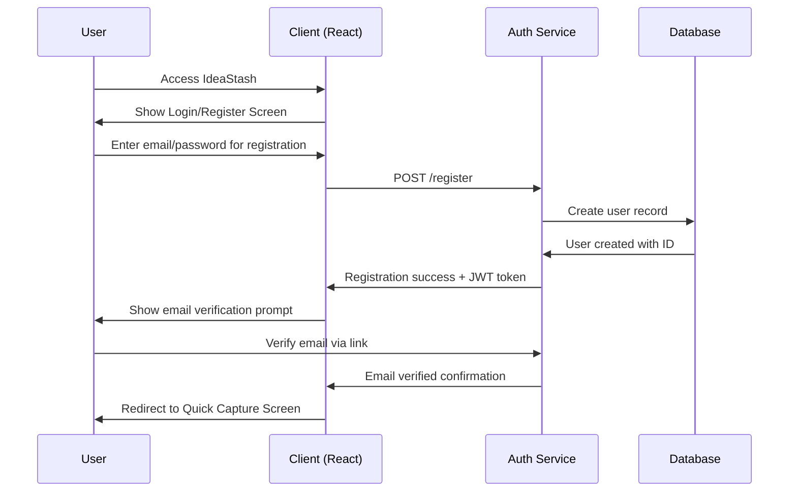
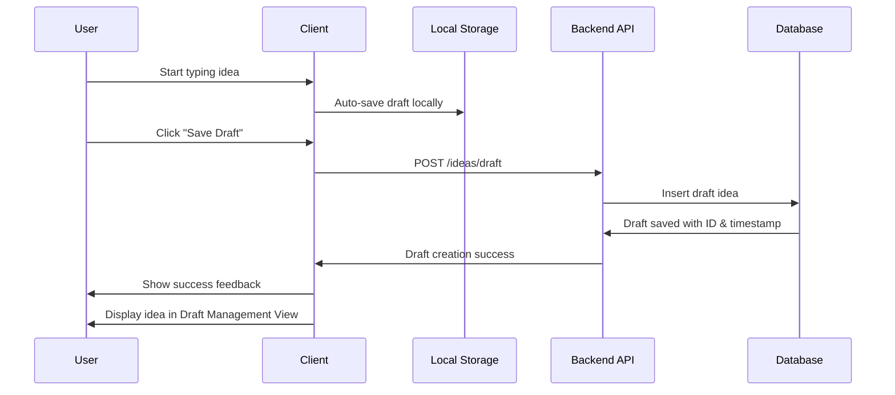
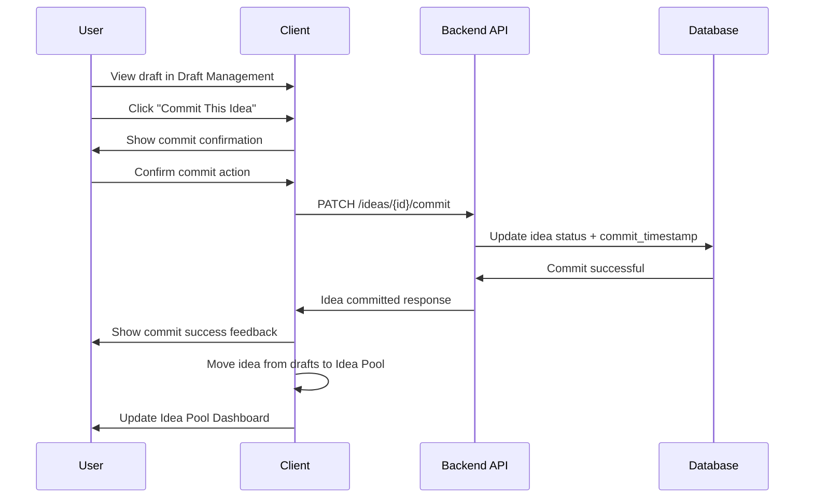
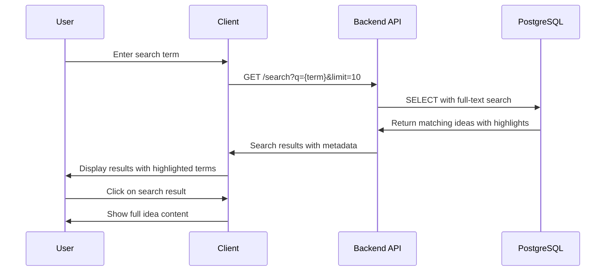
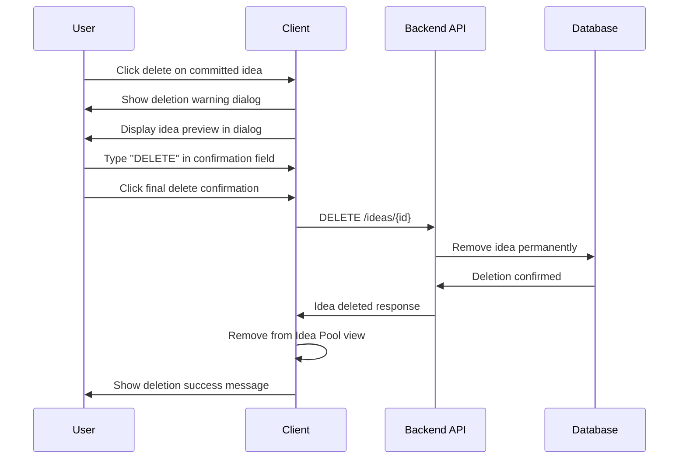
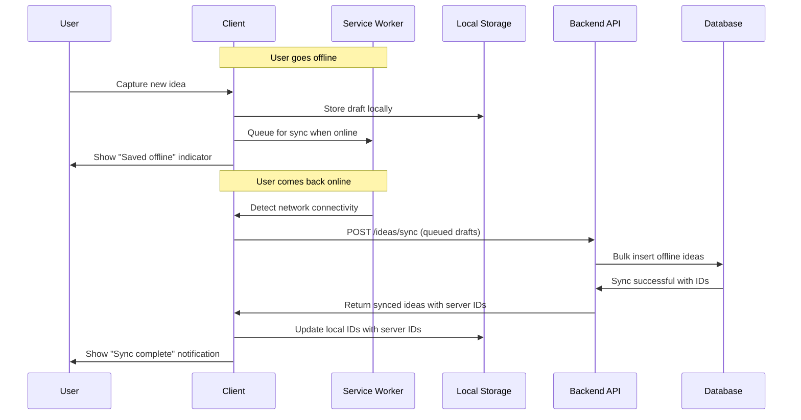

# User Flow Sequence Diagrams

## 1. User Registration & Authentication Flow

## 2. Quick Idea Capture Flow

## 3. Draft-to-Commit Workflow

## 4. Search & Discovery Flow

## 5. Intentional Deletion Flow

## 6. Offline Sync Flow

